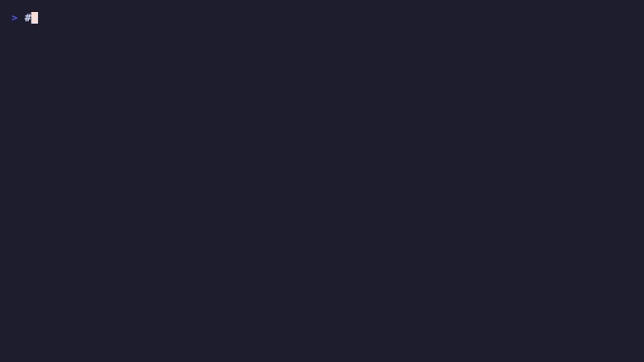
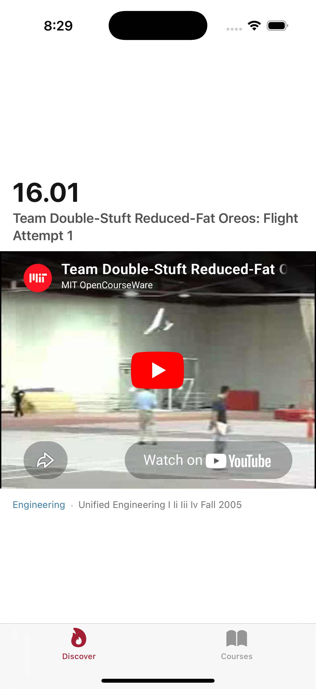
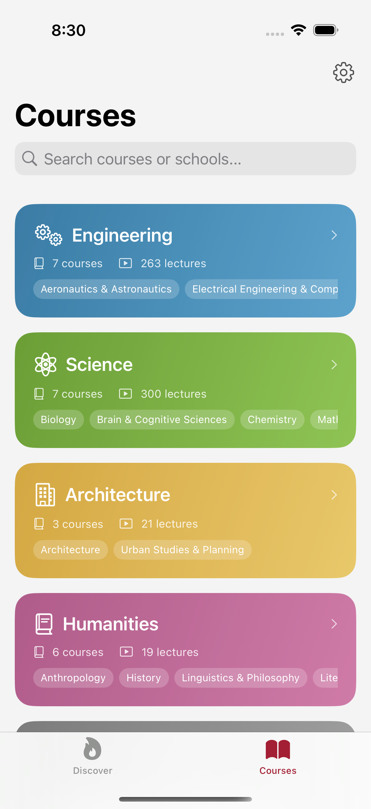
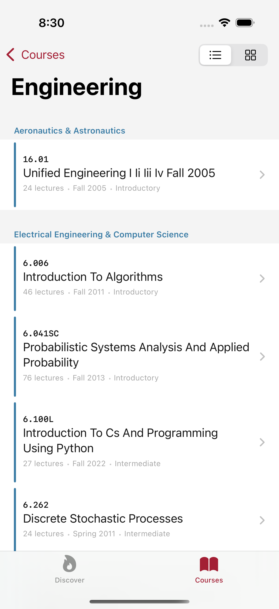
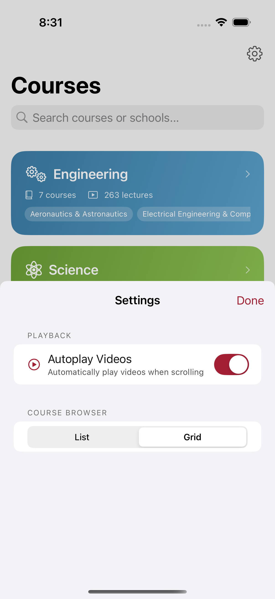

# MIT Reels




A native iOS app that turns the world's best university lectures into a TikTok-style vertical video feed. Browse 7,000+ lectures from MIT, Stanford, Harvard, Yale, and 50+ educational sources — all in one swipe.

Built with SwiftUI + SwiftData. Zero external dependencies. Designed for clarity.

---

<p align="center">
  
  &nbsp;&nbsp;
  
  &nbsp;&nbsp;
  
  &nbsp;&nbsp;
  
</p>

<p align="center">
  <sub>Discover Feed &nbsp;|&nbsp; School Hub &nbsp;|&nbsp; Course Browser &nbsp;|&nbsp; Settings</sub>
</p>

---

## Why

The best lectures in the world are free — MIT, Stanford, Harvard, 3Blue1Brown, Khan Academy — but they're buried across dozens of YouTube channels with no unified discovery experience. You have to know what you're looking for.

MIT Reels makes educational content as discoverable as entertainment. Open the app, swipe, learn. The feed algorithm adapts to what you like (thumbs-up) and what you skip (thumbs-down), surfacing more of what resonates. No accounts, no ads, no tracking — just lectures.

## How It Works

**Feed Engine** — An actor-isolated sliding-window pipeline computes batches of 10 items using stratified weighted sampling. Thumbs-up at position 5 influences what appears at position 15. Velocity-aware: normal scrolling buffers 10 items; a fast fling expands to 30.

**Scroll Physics** — `SlidingLoopStateMachine` runs a spring integrator at a fixed 240 Hz quantum regardless of display refresh rate. This makes the settle trajectory a pure function of elapsed time — identical on 60 Hz and 120 Hz ProMotion, and stable through a frame stutter. Velocity is handed off to the tracker on a mid-settle interrupt, so grabbing a moving page feels natural instead of snapping to a dead stop.

**Preference Learning** — Source and topic weights (0.1x–3.0x) bias the random sampling. Thumbs-up adds +0.1, thumbs-down subtracts -0.2. Weights persist across sessions. The system also tracks soft signals: fast skips (<1.5s) gently downweight, long watches (>30s) gently boost.

**Validation Pipeline** — Every video is confirmed playable via YouTube oEmbed before entering the feed. A background scraper discovers new MIT lectures every 24 hours. Periodic re-validation (7-day cycle) catches deleted or privatized videos.

**Thumbnail Prefetching** — Three-tier cache: in-memory NSCache (O(1), ~0ms) → URLCache (disk, ~5ms) → network (~200ms). Seven thumbnails are always warm around the current position.

**Source Classification** — `SourceParser` is a pure, total classifier for pasted references: YouTube video (11-char base64 id), YouTube playlist, direct image URL, or web page. No I/O, no global state — the same input always returns the same `Result`. This is the foundation for BYOA (Bring Your Own Archive) where users point the loop at their own content.

## Features

**Discover Feed** — Doom-scroll through randomized lectures from 51 educational sources. One swipe, one page. Haptic snap on each transition. Autoplay toggleable.

**School Hub** — MIT courses organized by five schools: Engineering, Science, Architecture & Planning, Humanities, and Cross-Disciplinary. Gradient cards show course counts and department pills.

**Course Browser** — Drill into any school to browse courses by department. Toggle between list and grid views. Tap a course to enter its dedicated lecture feed.

**Multi-Source Discovery** — 51 sources including MIT, Stanford, Harvard, Yale, Caltech, Berkeley, 3Blue1Brown, Khan Academy, Crash Course, freeCodeCamp, Computerphile, Fireship, and more. MIT is always on; enable others in Settings.

**Fullscreen Video** — YouTube iframe embed with native fullscreen support. Timeline scrubber for seeking. Thumbnail poster images while loading. Captions toggle.

**School Color Customization** — Each of the five MIT schools has a default accent derived from a perceptually-uniform OKLCH palette (equal lightness = equal legibility across all hues). Tap any school's color swatch in Settings to override with a `ColorPicker`, reset per-school, or reset all at once. Overrides persist across sessions.

**Preference Engine** — Thumbs-up/down with animated feedback and toast notifications. Dislike auto-advances to the next reel. Shake to open source filter. View and reset your preference weights in Settings.

**Background Catalog Sync** — OCW scraper runs in the background every 24 hours, expanding the lecture catalog from live MIT sitemaps. YouTube API fetches for enabled non-MIT sources.

## Architecture

```
MITReels/
├── Design/          # Carbon design tokens, OKLCH palette, typography
├── Models/          # SwiftData models + AppState (central env object) + Source types
├── Physics/         # SlidingLoopStateMachine — fixed-timestep spring scroll engine
├── Views/           # Main screens (Discover, Courses, SchoolDetail, CourseReels)
├── Components/      # Reusable UI (ReelView, SchoolCard, YouTubePlayer, Shimmer)
├── Services/        # FeedEngine, ThumbnailPrefetcher, OCWScraper, SourceParser
└── Utilities/       # Preview data, weighted shuffle
```

**Data flow**: `AppState` is the single `@Observable` env object injected at the root — school color overrides, future BYOA state. `@Query` drives reactive SwiftData reads. `FeedEngine` actor computes the feed off main thread using `FeedItem` Sendable DTOs. `WeightSnapshot` copies preference weights once per batch.

**Video**: `ReelPlayerPool` holds 5 warm `WKWebView` slots with staggered initialization. Players are assigned O(1) by index; ownership transfers between views on scroll so no player is ever re-created mid-session.

**Scroll physics**: `SlidingLoopStateMachine` (pure value type, no UIKit) owns state transitions (Idle → Dragging → Settling → Idle). Spring integration runs at a fixed 1/240 s quantum with an accumulator to absorb float drift at clean refresh rates. The host view feeds `UIScrollViewDelegate` callbacks into the machine.

**Thread safety**: Actor isolation for feed computation. `@MainActor` for all SwiftData and UI state. `FeedItem` value types cross the actor boundary — no `@Model` objects leak into background threads.

## Design

Inspired by the [NASA Graphics Standards Manual (1975)](https://standardsmanual.com/products/nasa-graphics-standards-manual). Bold typography. Systematic spacing (golden ratio scale). Zero decoration. The interface stays out of the way so the lectures can speak.

Color tokens follow IBM Carbon's White Theme for WCAG 2.1 contrast compliance. School accent colors use an OKLCH palette — equal perceptual lightness across all five hues, so white text reads equally well on every school card and no color dominates the others visually. Users can override any school's color from Settings.

## Tech Stack

- **SwiftUI** — Declarative UI; `UIScrollView` + `CADisplayLink` for physics-driven paging
- **SwiftData** — Persistent storage with `@Query` reactive fetching
- **Swift Concurrency** — Actor-isolated feed engine, structured concurrency
- **WKWebView** — YouTube iframe embed with JavaScript bridge; pooled via `ReelPlayerPool`
- **OKLCH** — Perceptually-uniform color space for school palette (custom Swift initializer, no external deps)
- **XcodeGen** — Project generation from `project.yml`
- **Maestro** — Automated UI testing flows
- **Swift Testing** — Modern `@Test` macro-based unit tests (124 total, 0 failures)

## Requirements

- iOS 17.0+
- Xcode 16+
- Swift 5.9+

## Build

```bash
# Generate Xcode project
xcodegen generate

# Build for simulator
xcodebuild -project MITReels.xcodeproj -scheme MITReels \
  -destination 'platform=iOS Simulator,name=iPhone 16 Pro' build

# Run tests
xcodebuild test -project MITReels.xcodeproj -scheme MITReels \
  -destination 'platform=iOS Simulator,name=iPhone 16 Pro'

# Run Maestro UI tests
maestro test .maestro/
```

## Progress

See [PROGRESS.md](PROGRESS.md) for the full development timeline and architecture evolution.

## License

Educational project. MIT OCW content is provided under MIT OpenCourseWare's [Creative Commons license](https://ocw.mit.edu/terms/).
