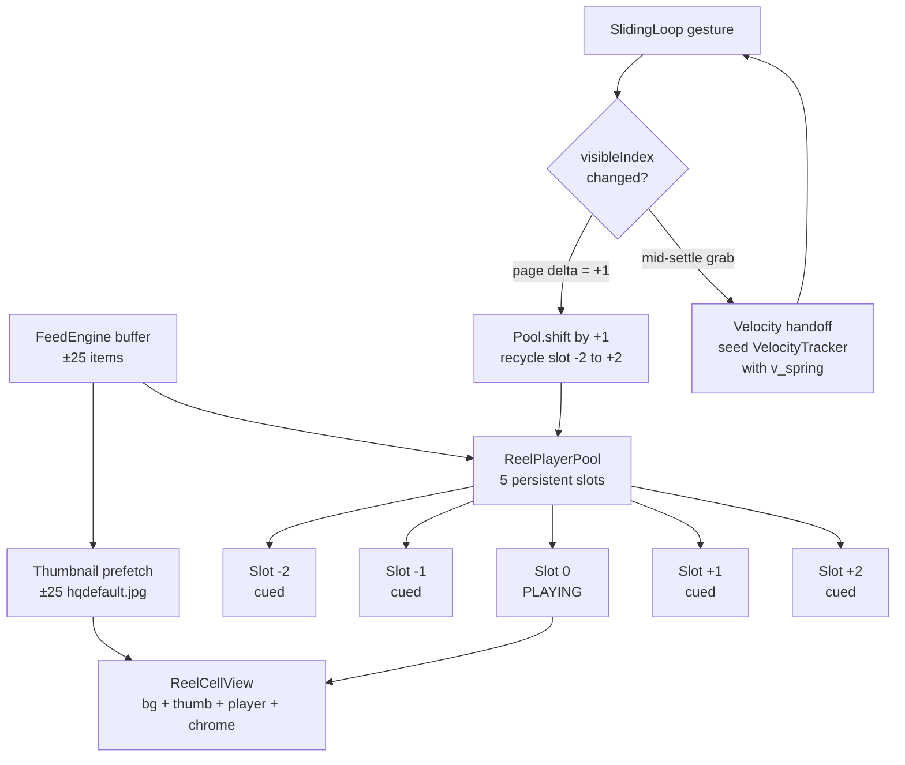

# Zero-Wait Reel Pool — Design Spec

## Context

The MIT OCW Reels discover feed recently shipped an Instagram-style vertical pager backed by a custom SlidingLoop physics engine (critically-damped spring, `response=0.28s`, rolling velocity tracker, single-page snap). The *data* layer already prefetches aggressively — `FeedEngine` buffers 10–30 items based on scroll velocity (`MITReels/Services/FeedEngine.swift:138-147`). The *video* layer does not: only the immediate next reel is primed, via `isNearby = (lecture.youtubeId == nextId)` in `MITReels/Views/DiscoverView.swift:228`.

Consequence: on rapid consecutive swipes, every swipe past the first shows a thumbnail-to-player transition delay while a freshly checked-out `WKWebView` boots a YouTube iframe (~400–800ms cold).

### Goal

Pass the **rapid interaction test**: 5+ consecutive flicks with no visible load. Every swipe lands on a player that is already decoded and ready in <80ms.

### Secondary

Fix a physics gap in `SlidingLoopStateMachine`: `willBeginDragging()` currently resets the velocity tracker (`MITReels/Physics/SlidingLoopStateMachine.swift:53-55`), losing any in-flight spring velocity when the user grabs the screen mid-settle. This is the POP "Down pulse" behavior from Origami/Quartz Composer — the page should feel like a moving object your finger catches, not a stopped object your finger starts.

## Architecture



## Non-Goals

- **No AVPlayer refactor.** We stay on YouTube iframe + WKWebView. Switching to raw HLS/AVPlayer would be a rewrite and YouTube ToS would be a separate conversation.
- **No modular/infinite-loop index.** The feed remains a linear `[Lecture]` with history + buffer as today.
- **No multi-page flings.** A hard flick still advances exactly one page. Doom-scroll here means *no wait*, not *skip three videos in one gesture*. Instagram Reels and TikTok both behave this way.
- **No change to physics constants.** `response=0.28`, `flickThreshold=500` pts/sec landed and feel right (`MITReels/Physics/Spring.swift:17`, `MITReels/Physics/SnapTarget.swift:21`).

## Acceptance Criteria

1. 5 consecutive swipes at 150ms interval on FlowDeck simulator — zero visible thumbnail-to-player transitions after swipe #1.
2. Mid-settle gesture grab — page motion is continuous; no dead-stop snap.
3. Backward swipe (back to previously watched reel) — video is already cued; no re-load.
4. Memory footprint on iPhone 12 simulator under doom-scroll ≤ 400 MB.
5. Memory warning response — pool shrinks to ±1, recovers to ±2 on idle tick.
6. All existing SlidingLoop physics tests continue to pass.

## Components

### 1. `ReelPlayerPool` — new, `MITReels/Services/ReelPlayerPool.swift`

An `@MainActor` class owning **5 persistent `WKWebView` instances** for the lifetime of the feed. Never torn down; only re-assigned. All 5 share a single `WKProcessPool` + `WKWebsiteDataStore.default()` so `yt-player.js` (~200 KB) downloads once and all iframes re-use the cached bundle.

**Keying**: slots are keyed by *relative position from current center*, not by lecture identity. As the user scrolls, the slot dictionary rotates. Lecture identity is an attribute of a slot, not its key.

**Warm-up pattern — `loadVideoById({mute: true})` + pause-at-zero (NOT `cueVideoById`).** Per the YouTube IFrame Player API docs (https://developers.google.com/youtube/iframe_api_reference), `cueVideoById` "does not request the video stream until `playVideo()` or `seekTo()` is called." State 5 (CUED) is a metadata-ready signal, not a decoded-first-frame signal. Relying on CUED is what caused our spec v1 to over-promise.

The correct warm-up sequence per slot:

```
loadVideoById({videoId, mute: 1}) → state 3 (buffering) → state 1 (playing, muted, offscreen α=0)
  → pauseVideo() + seekTo(0) → state 2 (paused at t=0, first frame decoded) → WARM
  → [on select] unMute() + playVideo() → instant visible playback
```

This is the only documented path that guarantees a decoded first frame on an iOS WKWebView-hosted iframe. The downside: brief audio could leak if `mute: 1` is ignored; mitigated by starting the iframe with `playerVars.mute = 1` at HTML-load time, not only at `loadVideoById` time.

**Public API**:
```swift
@MainActor final class ReelPlayerPool {
    init(capacityPerSide: Int = 2)  // 2 → 5 slots total

    /// Called by DiscoverView when visibleIndex changes.
    /// Rotates slot assignments and re-cues rolled-off slots.
    func shift(toCenterIndex index: Int, in lectures: [Lecture])

    /// Cell asks for the player view matching its relative position.
    /// Returns nil if the cell is outside the ±2 window.
    func playerView(forRelativePosition rp: Int) -> UIView?

    /// Called when the center slot should start playing.
    func playCenter()

    /// Called on drag-begin: pause playback but keep slots cued.
    func pauseAllButCenter()

    /// Called on memory warning — shrink to ±1, release far slots' video data.
    func handleMemoryPressure()
}
```

**Slot state machine**:

```
                       +------timeout 10s / error------+
                       v                               |
[empty] --assign--> [loading] --state 1 (playing)--> [warming] --pauseVideo + seekTo(0)--> [warm]
   ^                                                                                         |
   |                                                                                         | [on select: unMute + playVideo]
   |                                                                                         v
   |                                                                                      [playing]
   |                                                                                         |
   |                                                                                         | [on deselect: pauseVideo + mute]
   |                                                                                         v
   |                                                                                      [warm]
   |                                                                                         |
   +----release(mem warn / jetsam)----[recycled] <-----------------------------------------+
                                           |
                                           +--assign(new id)--> [loading]

[loading|warming] --> [failed] --retry next shift--> [loading]
```

- `loading` — `loadVideoById({videoId, mute: 1})` called, awaiting YouTube state transition to 1 (PLAYING, muted, `alpha = 0`)
- `warming` — player emitted state 1, `pauseVideo()` + `seekTo(0)` called; waiting for first-frame paint confirmation (state 2 at time 0)
- `warm` — first frame decoded, paused, muted, off-alpha. Can be brought to `playing` via `unMute()` + `playVideo()` in <50ms
- `playing` — exactly one slot (the center) at a time. Audible, `alpha = 1`
- `failed` — load timeout (10s) or YouTube error; thumbnail-only fallback; retried on next `shift` that touches this slot. After 3 consecutive failures per slot, stays thumbnail-only until the cell disappears
- `recycled` — slot released under memory pressure OR after `webView:webContentProcessDidTerminate:` (jetsam). Iframe cleared via `loadHTMLString("")`. Re-assigns on next `shift`

### 2. `ReelView` — ownership transfer, *not* layout rewrite

The existing `MITReels/Views/ReelView.swift` **already has the target layer stack**: `CachedThumbnailView` under a `YouTubePlayerView` with an opacity crossfade (`ReelView.swift:261-316`). The refactor is scoped to *ownership transfer*, not layout replacement:

**What moves off `ReelView`:**
- `@State` video vars (`isVideoLoading`, `hasVideoError`, `showVideoLayer`, `currentTime`, `duration`, `isPlaying`, `seekTarget`) — these migrate onto **slot state** in `ReelPlayerPool`
- `YouTubePlayerView`'s inline `WKWebViewPool.shared.checkout()` path — replaced by a thin `UIViewRepresentable` that *borrows* a pool-owned `UIView` container via `pool.playerView(forRelativePosition:)`

**What stays on `ReelView`:**
- All existing SwiftUI layout (`VStack`, metadata, OCW links, chrome)
- `CachedThumbnailView` underneath — the "2 ms" floor
- Haptics, toasts, like/dislike handling

**Lifecycle:**
- `onAppear` → cell computes its `relativePosition` from the scroll state and asks `pool.playerView(forRelativePosition:)`. If non-nil, attaches it as a subview of the existing video container. Thumbnail stays visible underneath.
- Slot alpha: `0` while `loading|warming`, `0` for non-center `warm` slots, `1` only on center after `state 1 (playing)` fires post-unmute. Fade driven by a 80 ms animation on the transition.
- Optional polish (Phase 6): before unmute, call `WKWebView.takeSnapshot()` on the warm slot, show the snapshot UIImage as a one-frame poster during the unmute handoff. Hides any residual compositor jank.
- `onDisappear` (cell rolls outside ±2) — WebView detaches. Slot is free to be reassigned by the next `shift`.

### 3. Velocity Handoff in `SlidingLoopStateMachine`

**Current** (`MITReels/Physics/SlidingLoopStateMachine.swift:53-56`):
```swift
mutating func willBeginDragging() {
    velocityTracker.reset()  // ← discards spring velocity
    state = .dragging
}
```

**New — scalar velocity handoff (Origami pattern).** The authoritative POP / Origami pattern (`~/Desktop/origami/Origami Plugin/POPBouncyPatch.mm:144-152`) treats velocity as *first-class state*: `iteration->spring.velocity = @(inputVelocity.doubleValue)` is written directly to the running spring mid-gesture. There is no "reconstruct from position deltas" step. We model this in `VelocityTracker` by adding a `pendingVelocity: Double?` field that seeds the tracker's reading and is naturally overwritten once two real touch samples accumulate.

```swift
// SlidingLoopStateMachine.willBeginDragging
mutating func willBeginDragging() {
    let residual: Double = {
        if case .settling = state { return spring.velocity }
        return 0
    }()
    velocityTracker.seedVelocity(residual)   // ← preserves spring velocity
    state = .dragging
}
```

Add `VelocityTracker.seedVelocity(_ v: Double)` that sets `pendingVelocity = v`. The `velocity` accessor becomes:

```swift
var velocity: Double {
    if samples.count >= 2 { return computedFromSamples }
    return pendingVelocity ?? 0
}
```

The seeded value only governs the instant between `willBeginDragging` and the first `add(position:at:)` call that makes the window have ≥2 samples. Once the rolling window is populated, the user's real motion takes over seamlessly. This is the cleanest model for the Origami "catch-the-moving-page" behavior — no synthetic samples, no window corruption, no edge case when the user re-releases without moving (the pending velocity remains correct).

### 4. Thumbnail Prefetch — extend existing `ThumbnailPrefetcher`

An actor-like `ThumbnailPrefetcher.shared` already exists at `MITReels/Services/ThumbnailPrefetcher.swift` with:
- `NSCache<NSString, UIImage>` (countLimit 30, totalCostLimit 20 MB)
- In-flight coalescing via `inFlight: [String: Task<Void, Never>]` (a second call for the same id returns the same task)
- `handleMemoryWarning()` wired at `DiscoverView.swift:189`
- URL pattern `https://img.youtube.com/vi/{videoId}/hqdefault.jpg`

We *extend*, not replace:

1. Bump `countLimit` from 30 → **64** (~20 KB × 64 ≈ 1.3 MB, negligible)
2. Add a `prefetchIdsAround(index:window:in:)` helper (or just call `displayWindow.prefix(index+25).suffix(50)` inline from DiscoverView) to get the ±25 window. `FeedEngine.prefetchIds(count:)` is forward-only today; backward prefetch must read from `FeedEngine.displayWindow` which includes history.
3. Widen the prefetch call at `DiscoverView.swift:130` from `count: 6` → **±25 around visibleIndex**, preserving the in-flight coalescing so no duplicate tasks fire.

No new cache stratum. Reusing the existing component avoids drift and keeps the memory-warning path single-source.

### 5. `FeedEngine` — no changes needed

The data layer already buffers 10–30 items by velocity. Only the caller's prefetch count widens.

## Data Flow

```
User swipes (visibleIndex 10 → 11)
  │
  ├─> SlidingLoopHostScrollView tick settles; fires onVisibleIndexChanged(11)
  │
  ├─> DiscoverView:
  │     ├─> FeedEngine.advance(to: 11)              // existing
  │     ├─> ThumbnailCache.prefetch(ids: [-25…+25]) // widened
  │     └─> pool.shift(toCenterIndex: 11, in: lectures)
  │
  ├─> ReelPlayerPool.shift(toCenterIndex: 11):
  │     Before: slots held [lec8, lec9, lec10▶, lec11, lec12] at positions [-2,-1,0,+1,+2]
  │     After:  slots hold  [lec9, lec10, lec11▶, lec12, lec13] at positions [-2,-1,0,+1,+2]
  │
  │     Operations performed by shift:
  │     ├─> dict rotate: slot at position P now holds what slot at (P+1) held
  │     ├─> old slot[0]'s WebView: pauseVideo + seekTo(0); now at position [-1]
  │     ├─> old slot[+1]'s WebView: playVideo; now at position [0] (center)
  │     ├─> old slot[-2]'s WebView (was lec8, rolled off): cueVideoById(lec13); now at position [+2]
  │     └─> old slots[-1], [+2]: untouched, just relabeled (-1→-2, +2→+1)
  │
  └─> ReelCellView(lecture[11]).onAppear:
        ├─> thumbnail shows instantly
        ├─> pool.playerView(forRelativePosition: 0) attaches WebView
        └─> alpha 0 → 1 over 80ms when YouTube state → playing (5 → 1)
```

## Error Handling

- **Warm-up timeout** (10s from `loadVideoById`): slot marked `failed`. Thumbnail remains visible. Retry on next `shift` that touches this slot.
- **YouTube rate-limit / 429**: slot `failed`, backoff 2s, retry. After 3 consecutive failures per slot, slot stays thumbnail-only until cell disappears. Telemetry log.
- **Pool exhaustion**: impossible by design — 5 slots, capacity fixed. An assertion fires if slot accounting drifts (caught in tests).
- **Memory pressure** (`UIApplication.didReceiveMemoryWarningNotification`): pool recycles `-2` and `+2` to `empty` state (drops their iframes via `loadHTMLString("")`). Re-expands to full ±2 after 500 ms idle via a `Task.sleep + shift(toCenterIndex:)` re-poke.
- **WebContent process jetsam** (`WKNavigationDelegate.webView(_:webContentProcessDidTerminate:)`): catch on the pool's shared nav delegate. Mark the dead slot `recycled`, immediately call `loadHTMLString(playerHTML, baseURL:)` to re-seed it, then re-warm on the next `shift` pass. Without this handler iOS silently kills WebContent processes under memory pressure and the user sees a permanent thumbnail.
- **Invalid youtubeId**: slot stays `loading` indefinitely → timeout fires at 10 s → `failed`. Thumbnail-only fallback gracefully covers this.

## Test Plan

### Unit tests (Swift Testing, `MITReelsTests/`)

- **`ReelPlayerPoolTests.swift`** (new)
  - `test_shift_rotates_slot_indices_correctly`
  - `test_shift_recycles_rolled_off_slot_with_new_cue`
  - `test_shift_backward_reuses_cued_slot_no_recue`
  - `test_memoryPressure_shrinks_to_plus_minus_1`
  - `test_memoryPressure_recovery_re_cues_far_slots`

- **`SlidingLoopStateMachineTests.swift`** (extend)
  - `test_velocityHandoff_preserves_spring_residual_on_midSettle_grab`
  - `test_velocityHandoff_zero_when_grabbed_at_rest`

- **`VelocityTrackerTests.swift`** (extend)
  - `test_seedWithVelocity_produces_expected_reading`

- **`ThumbnailCacheTests.swift`** (new)
  - `test_LRU_eviction_at_64_entries`
  - `test_concurrent_fetch_coalesces_into_single_task`
  - `test_cached_read_is_synchronous`

### Integration tests (FlowDeck simulator, manual)

- **Rapid interaction** — doom-scroll 30 reels at ~150ms/swipe on iPhone 12 sim. Record video, inspect frame-by-frame for thumbnail flash. **Pass criterion**: zero flashes after swipe #1.
- **Mid-settle grab** — swipe, then tap-and-drag at 50% through the settle animation. Repeat 10 times. **Pass criterion**: page motion is continuous (no snap-to-stop).
- **Backward scroll** — forward 5, backward 5. **Pass criterion**: no re-cue on backward path (verified via pool debug log).
- **Memory ceiling** — iPhone SE 2nd-gen sim, doom-scroll 50 reels. **Pass criterion**: peak resident <400 MB.
- **Memory warning** — trigger `simulateMemoryWarning` during playback. **Pass criterion**: no crash, no visual glitch, pool recovers within 1s.

### Debug harness

Extend `MITReels/Components/SlidingLoopPreview.swift` with a `ReelPlayerPoolPreview` that wires the pool to a fake `[Lecture]` list and shows slot state overlays (cued / playing / failed) during scroll.

## Rollout Phases

| Phase | Scope | Size | Commit |
|------|-------|------|--------|
| **1** | Velocity handoff in `VelocityTracker` + `SlidingLoopStateMachine` + unit tests (scalar `pendingVelocity` pattern) | XS | `feat(physics): velocity handoff on mid-settle grab` |
| **2** | `ReelPlayerPool` primitive — 5 slots, shared `WKProcessPool`, `loadVideoById(mute)` + pause-at-zero warm-up, jetsam recovery, unit tests (no UI integration) | M | `feat(players): introduce ReelPlayerPool with 5 warm slots` |
| **3** | Extend `ThumbnailPrefetcher` — bump LRU to 64, widen prefetch to ±25 around `visibleIndex` (read from `displayWindow` for backward window) | S | `feat(discover): widen thumbnail prefetch window to ±25` |
| **4** | `ReelView` ownership transfer — migrate video `@State` onto slot state, replace inline `YouTubePlayerView` with pool-borrowing `UIViewRepresentable`. Layout unchanged. | M | `refactor(reel): pool-owned player borrowed by ReelView` |
| **5** | Wire pool into `DiscoverView`, retire `isNearby`/`nextId` path, **delete `WKWebViewPool.shared`** and its 8 call sites, call `ReelPlayerPool.warmUp()` on app init | S | `feat(discover): adopt ReelPlayerPool, retire WKWebViewPool` |
| **6** | FlowDeck + Instruments validation — measure peak memory (Allocations), first-frame latency (Time Profiler), scroll jank (Core Animation); tune crossfade ms, cache size, snapshot-poster toggle | S | `chore(reel): tune pool parameters from Instruments measurements` |

Each phase is a standalone commit. Phase 1 lands independently — no dependencies on any of 2–6. Phases 2 and 3 can land without affecting current behavior. Phase 4 prepares the ground but does not switch the codepath (dual-owned WebView is the migration bridge). Phase 5 is the cutover and the phase that deletes the old pool.

## Open Parameters (tuned during Phase 6)

- Crossfade duration: 80 ms vs 120 ms — feel test on simulator
- Snapshot-poster toggle: do we take `WKWebView.takeSnapshot()` before unmute, or rely on CoreAnimation compositing alone? Phase 6 A/B on simulator
- `ThumbnailPrefetcher.countLimit`: 64 vs 128
- Whether to promote to adaptive pool sizing (±2 ↔ ±3 by velocity) — only if Phase 6 shows a measurable gap during flings
- `loadVideoById` vs `cueVideoById` fallback — if the mute-autoplay-pause pattern proves unreliable (audio leak, state 1 delay), fall back to `cueVideoById` and accept the ~300 ms playVideo() latency as a known gap

## References

- Facebook POP (`~/Desktop/origami/Origami Plugin/pop.framework`) — `POPSpringAnimation.h:35` `velocity` property; handoff pattern at `POPBouncyPatch.mm:144-152` (`iteration->spring.velocity = @(inputVelocity.doubleValue)` — direct scalar write, no sample reconstruction).
- YouTube IFrame Player API — https://developers.google.com/youtube/iframe_api_reference. Key finding: `cueVideoById` "does not request the video stream until `playVideo()` or `seekTo()` is called" — state 5 (CUED) is not a decoded-frame signal. Use `loadVideoById({mute: 1})` + pause-at-zero for actual first-frame decode.
- Mux "Building TikTok smooth scrolling on iOS" — https://www.mux.com/blog/building-tiktok-smooth-scrolling-on-ios — confirms the preload/display/visible state model, does not publish pool size.
- Apple `WKProcessPool` — https://developer.apple.com/documentation/webkit/wkprocesspool — sharing a process pool collapses fixed process overhead across multiple WebViews and enables cookie/cache sharing via `WKWebsiteDataStore.default()`.
- WKWebView jetsam recovery — `webView(_:webContentProcessDidTerminate:)` — https://nevermeant.dev/handling-blank-wkwebviews/. Required handler to recover from iOS killing backgrounded WebContent processes under memory pressure.
- Current branch state: `MITReels/Physics/*`, `MITReels/Components/SlidingLoop*.swift`, `MITReels/Views/{DiscoverView,ReelView,YouTubePlayerView}.swift`, `MITReels/Services/{FeedEngine,ThumbnailPrefetcher,WKWebViewPool}.swift`
